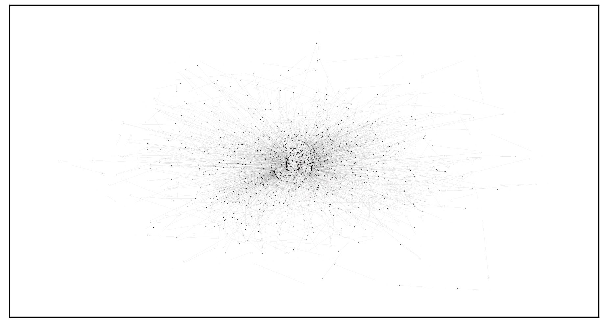

# RaKUn 2.0
This is the repository containing the implementation of RaKUn 2.0, a very fast keyphrase extraction algorithm suitable for large-scale keyphrase retrieval.


[](https://github.com/SkBlaz/rakun2/actions/workflows/python-pip-unit.yml)
[](https://github.com/SkBlaz/rakun2/actions/workflows/pylint.yml)
[](https://github.com/SkBlaz/rakun2/actions/workflows/unit-tests.yml)
[](https://github.com/SkBlaz/rakun2/actions/workflows/python-app.yml)

# Installation and setup
The tool is distributed as a simple-to-use Python library. Simply

```python
pip install rakun2
```
Next, verify that main configurations of the algorithm return sensible results

```python
python -m pytest ./tests/test_main_functionality.py 
```
If all tests pass, you should be good to go.

# Examples
A simple self-contained example of keyphrases extracted from the Wiki article on Artificial Intelligence follows:

```python

from rakun2 import RakunKeyphraseDetector

example_document = """
Artificial intelligence (AI) is intelligence demonstrated by machines, as opposed to the natural intelligence displayed by animals including humans. AI research has been defined as the field of study of intelligent agents, which refers to any system that perceives its environment and takes actions that maximize its chance of achieving its goals.[a]The term "artificial intelligence" had previously been used to describe machines that mimic and display "human" cognitive skills that are associated with the human mind, such as "learning" and "problem-solving". This definition has since been rejected by major AI researchers who now describe AI in terms of rationality and acting rationally, which does not limit how intelligence can be articulated.[b] AI applications include advanced web search engines (e.g., Google), recommendation systems (used by YouTube, Amazon and Netflix), understanding human speech (such as Siri and Alexa), self-driving cars (e.g., Tesla), automated decision-making and competing at the highest level in strategic game systems (such as chess and Go).[2] As machines become increasingly capable, tasks considered to require "intelligence" are often removed from the definition of AI, a phenomenon known as the AI effect.[3] For instance, optical character recognition is frequently excluded from things considered to be AI,[4] having become a routine technology.[5] Artificial intelligence was founded as an academic discipline in 1956, and in the years since has experienced several waves of optimism,[6][7] followed by disappointment and the loss of funding (known as an "AI winter"),[8][9] followed by new approaches, success and renewed funding.[7][10] AI research has tried and discarded many different approaches since its founding, including simulating the brain, modeling human problem solving, formal logic, large databases of knowledge and imitating animal behavior. In the first decades of the 21st century, highly mathematical-statistical machine learning has dominated the field, and this technique has proved highly successful, helping to solve many challenging problems throughout industry and academia.[10][11] The various sub-fields of AI research are centered around particular goals and the use of particular tools. The traditional goals of AI research include reasoning, knowledge representation, planning, learning, natural language processing, perception, and the ability to move and manipulate objects.[c] General intelligence (the ability to solve an arbitrary problem) is among the field's long-term goals.[12] To solve these problems, AI researchers have adapted and integrated a wide range of problem-solving techniques—including search and mathematical optimization, formal logic, artificial neural networks, and methods based on statistics, probability and economics. AI also draws upon computer science, psychology, linguistics, philosophy, and many other fields. The field was founded on the assumption that human intelligence "can be so precisely described that a machine can be made to simulate it".[d] This raised philosophical arguments about the mind and the ethical consequences of creating artificial beings endowed with human-like intelligence; these issues have previously been explored by myth, fiction and philosophy since antiquity.[14] Computer scientists and philosophers have since suggested that AI may become an existential risk to humanity if its rational capacities are not steered towards beneficial goals.[e] Contents     1 History         1.1 Fictions and early concepts         1.2 Early researches         1.3 From expert systems to machine learning     2 Goals         2.1 Reasoning, problem-solving         2.2 Knowledge representation         2.3 Planning         2.4 Learning         2.5 Natural language processing         2.6 Perception         2.7 Motion and manipulation         2.8 Social intelligence         2.9 General intelligence     3 Tools         3.1 Search and optimization         3.2 Logic         3.3 Probabilistic methods for uncertain reasoning         3.4 Classifiers and statistical learning methods         3.5 Artificial neural networks             3.5.1 Deep learning         3.6 Specialized languages and hardware     4 Applications         4.1 Fields of actions         4.2 Legal aspects     5 Philosophy         5.1 Defining artificial intelligence             5.1.1 Thinking vs. acting: the Turing test             5.1.2 Acting humanly vs. acting intelligently: intelligent agents         5.2 Evaluating approaches to AI             5.2.1 Symbolic AI and its limits             5.2.2 Neat vs. scruffy             5.2.3 Soft vs. hard computing             5.2.4 Narrow vs. general AI         5.3 Machine consciousness, sentience and mind             5.3.1 Consciousness             5.3.2 Computationalism and functionalism             5.3.3 Robot rights     6 Future         6.1 Superintelligence         6.2 Risks             6.2.1 Technological unemployment             6.2.2 Bad actors and weaponized AI             6.2.3 Algorithmic bias             6.2.4 Existential risk         6.3 Ethical machines         6.4 Regulation     7 In fiction     8 Scientific diplomacy         8.1 Warfare             8.1.1 Russo-Ukrainian War             8.1.2 Warfare regulations         8.2 Cybersecurity             8.2.1 Czech Republic's approach             8.2.2 Germany's approach             8.2.3 European Union's approach             8.2.4 Russo-Ukrainian War         8.3 Election security         8.4 Future of work             8.4.1 Facial recognition             8.4.2 AI and school             8.4.3 AI and medicine             8.4.4 AI in business             8.4.5 Business and diplomacy         8.5 AI and foreign policy     9 See also     10 Explanatory notes     11 Citations     12 References         12.1 AI textbooks         12.2 History of AI         12.3 Other sources     13 Further reading     14 External links  History Main articles: History of artificial intelligence and Timeline of artificial intelligence Fictions and early concepts Silver didrachma from Crete depicting Talos, an ancient mythical automaton with artificial intelligence Artificial beings with intelligence appeared as storytelling devices in antiquity,[15] and have been common in fiction, as in Mary Shelley's Frankenstein or Karel Čapek's R.U.R.[16] These characters and their fates raised many of the same issues now discussed in the ethics of artificial intelligence.[17] The study of mechanical or "formal" reasoning began with philosophers and mathematicians in antiquity. The study of mathematical logic led directly to Alan Turing's theory of computation, which suggested that a machine, by shuffling symbols as simple as "0" and "1", could simulate any conceivable act of mathematical deduction. This insight that digital computers can simulate any process of formal reasoning is known as the Church–Turing thesis.[18] The Church-Turing thesis, along with concurrent discoveries in neurobiology, information theory and cybernetics, led researchers to consider the possibility of building an electronic brain.[19] The first work that is now generally recognized as AI was McCullouch and Pitts' 1943 formal design for Turing-complete "artificial neurons".[20] Early researches By the 1950s, two visions for how to achieve machine intelligence emerged. One vision, known as Symbolic AI or GOFAI, was to use computers to create a symbolic representation of the world and systems that could reason about the world. Proponents included Allen Newell, Herbert A. Simon, and Marvin Minsky. Closely associated with this approach was the "heuristic search" approach, which likened intelligence to a problem of exploring a space of possibilities for answers. The second vision, known as the connectionist approach, sought to achieve intelligence through learning. Proponents of this approach, most prominently Frank Rosenblatt, sought to connect Perceptron in ways inspired by connections of neurons.[21] James Manyika and others have compared the two approaches to the mind (Symbolic AI) and the brain (connectionist). Manyika argues that symbolic approaches dominated the push for artificial intelligence in this period, due in part to its connection to intellectual traditions of Descarte, Boole, Gottlob Frege, Bertrand Russell, and others. Connectionist approaches based on cybernetics or artificial neural networks were pushed to the background but have gained new prominence in recent decades.[22] The field of AI research was born at a workshop at Dartmouth College in 1956.[f][25] The attendees became the founders and leaders of AI research.[g] They and their students produced programs that the press described as "astonishing":[h] computers were learning checkers strategies, solving word problems in algebra, proving logical theorems and speaking English.[i][27] By the middle of the 1960s, research in the U.S. was heavily funded by the Department of Defense[28] and laboratories had been established around the world.[29] Researchers in the 1960s and the 1970s were convinced that symbolic approaches would eventually succeed in creating a machine with artificial general intelligence and considered this the goal of their field.[30] Herbert Simon predicted, "machines will be capable, within twenty years, of doing any work a man can do".[31] Marvin Minsky agreed, writing, "within a generation ... the problem of creating 'artificial intelligence' will substantially be solved".[32] They failed to recognize the difficulty of some of the remaining tasks. Progress slowed and in 1974, in response to the criticism of Sir James Lighthill[33] and ongoing pressure from the US Congress to fund more productive projects, both the U.S. and British governments cut off exploratory research in AI. The next few years would later be called an "AI winter", a period when obtaining funding for AI projects was difficult.[8] From expert systems to machine learning In the early 1980s, AI research was revived by the commercial success of expert systems,[34] a form of AI program that simulated the knowledge and analytical skills of human experts. By 1985, the market for AI had reached over a billion dollars. At the same time, Japan's fifth generation computer project inspired the U.S and British governments to restore funding for academic research.[7] However, beginning with the collapse of the Lisp Machine market in 1987, AI once again fell into disrepute, and a second, longer-lasting winter began.[9] Many researchers began to doubt that the symbolic approach would be able to imitate all the processes of human cognition, especially perception, robotics, learning and pattern recognition. A number of researchers began to look into "sub-symbolic" approaches to specific AI problems.[35] Robotics researchers, such as Rodney Brooks, rejected symbolic AI and focused on the basic engineering problems that would allow robots to move, survive, and learn their environment.[j] Interest in neural networks and "connectionism" was revived by Geoffrey Hinton, David Rumelhart and others in the middle of the 1980s.[40] Soft computing tools were developed in the 80s, such as neural networks, fuzzy systems, Grey system theory, evolutionary computation and many tools drawn from statistics or mathematical optimization. AI gradually restored its reputation in the late 1990s and early 21st century by finding specific solutions to specific problems. The narrow focus allowed researchers to produce verifiable results, exploit more mathematical methods, and collaborate with other fields (such as statistics, economics and mathematics).[41] By 2000, solutions developed by AI researchers were being widely used, although in the 1990s they were rarely described as "artificial intelligence".[11] Faster computers, algorithmic improvements, and access to large amounts of data enabled advances in machine learning and perception; data-hungry deep learning methods started to dominate accuracy benchmarks around 2012.[42] According to Bloomberg's Jack Clark, 2015 was a landmark year for artificial intelligence, with the number of software projects that use AI within Google increased from a "sporadic usage" in 2012 to more than 2,700 projects.[k] He attributes this to an increase in affordable neural networks, due to a rise in cloud computing infrastructure and to an increase in research tools and datasets.[10] In a 2017 survey, one in five companies reported they had "incorporated AI in some offerings or processes".[43] The amount of research into AI (measured by total publications) increased by 50% in the years 2015–2019.[44] Numerous academic researchers became concerned that AI was no longer pursuing the original goal of creating versatile, fully intelligent machines. Much of current research involves statistical AI, which is overwhelmingly used to solve specific problems, even highly successful techniques such as deep learning. This concern has led to the subfield of artificial general intelligence (or "AGI"), which had several well-funded institutions by the 2010s.[12] Goals The general problem of simulating (or creating) intelligence has been broken down into sub-problems. These consist of particular traits or capabilities that researchers expect an intelligent system to display. The traits described below have received the most attention.[c] Reasoning, problem-solving Early researchers developed algorithms that imitated step-by-step reasoning that humans use when they solve puzzles or make logical deductions.[45] By the late 1980s and 1990s, AI research had developed methods for dealing with uncertain or incomplete information, employing concepts from probability and economics.[46] Many of these algorithms proved to be insufficient for solving large reasoning problems because they experienced a "combinatorial explosion": they became exponentially slower as the problems grew larger.[47] Even humans rarely use the step-by-step deduction that early AI research could model. They solve most of their problems using fast, intuitive judgments.[48] Knowledge representation Main articles: Knowledge representation, Commonsense knowledge, Description logic, and Ontology An ontology represents knowledge as a set of concepts within a domain and the relationships between those concepts. Knowledge representation and knowledge engineering[49] allow AI programs to answer questions intelligently and make deductions about real-world facts. A representation of "what exists" is an ontology: the set of objects, relations, concepts, and properties formally described so that software agents can interpret them.[50] The most general ontologies are called upper ontologies, which attempt to provide a foundation for all other knowledge and act as mediators between domain ontologies that cover specific knowledge about a particular knowledge domain (field of interest or area of concern). A truly intelligent program would also need access to commonsense knowledge; the set of facts that an average person knows. The semantics of an ontology is typically represented in description logic, such as the Web Ontology Language.[51] AI research has developed tools to represent specific domains, such as objects, properties, categories and relations between objects;[51] situations, events, states and time;[52] causes and effects;[53] knowledge about knowledge (what we know about what other people know);.[54] default reasoning (things that humans assume are true until they are told differently and will remain true even when other facts are changing); [55] as well as other domains. Among the most difficult problems in AI are: the breadth of commonsense knowledge (the number of atomic facts that the average person knows is enormous);[56] and the sub-symbolic form of most commonsense knowledge (much of what people know is not represented as "facts" or "statements" that they could express verbally).[48] Formal knowledge representations are used in content-based indexing and retrieval,[57] scene interpretation,[58] clinical decision support,[59] knowledge discovery (mining "interesting" and actionable inferences from large databases),[60] and other areas.[61] Planning Main article: Automated planning and scheduling An intelligent agent that can plan makes a representation of the state of the world, makes predictions about how their actions will change it and make choices that maximize the utility (or "value") of the available choices.[62] In classical planning problems, the agent can assume that it is the only system acting in the world, allowing the agent to be certain of the consequences of its actions.[63] However, if the agent is not the only actor, then it requires that the agent reason under uncertainty, and continuously re-assess its environment and adapt.[64] Multi-agent planning uses the cooperation and competition of many agents to achieve a given goal. Emergent behavior such as this is used by evolutionary algorithms and swarm intelligence.[65] Learning Main article: Machine learning Machine learning (ML), a fundamental concept of AI research since the field's inception,[l] is the study of computer algorithms that improve automatically through experience.[m] Unsupervised learning finds patterns in a stream of input. Supervised learning requires a human to label the input data first, and comes in two main varieties: classification and numerical regression. Classification is used to determine what category something belongs in—the program sees a number of examples of things from several categories and will learn to classify new inputs. Regression is the attempt to produce a function that describes the relationship between inputs and outputs and predicts how the outputs should change as the inputs change. Both classifiers and regression learners can be viewed as "function approximators" trying to learn an unknown (possibly implicit) function; for example, a spam classifier can be viewed as learning a function that maps from the text of an email to one of two categories, "spam" or "not spam".[69] In reinforcement learning the agent is rewarded for good responses and punished for bad ones. The agent classifies its responses to form a strategy for operating in its problem space.[70] Transfer learning is when the knowledge gained from one problem is applied to a new problem.[71] Computational learning theory can assess learners by computational complexity, by sample complexity (how much data is required), or by other notions of optimization.[72] Natural language processing Main article: Natural language processing A parse tree represents the syntactic structure of a sentence according to some formal grammar. Natural language processing (NLP)[73] allows machines to read and understand human language. A sufficiently powerful natural language processing system would enable natural-language user interfaces and the acquisition of knowledge directly from human-written sources, such as newswire texts. Some straightforward applications of NLP include information retrieval, question answering and machine translation.[74] Symbolic AI used formal syntax to translate the deep structure of sentences into logic. This failed to produce useful applications, due to the intractability of logic[47] and the breadth of commonsense knowledge.[56] Modern statistical techniques include co-occurrence frequencies (how often one word appears near another), "Keyword spotting" (searching for a particular word to retrieve information), transformer-based deep learning (which finds patterns in text), and others.[75] They have achieved acceptable accuracy at the page or paragraph level, and, by 2019, could generate coherent text.[76] Perception Main articles: Machine perception, Computer vision, and Speech recognition Feature detection (pictured: edge detection) helps AI compose informative abstract structures out of raw data. Machine perception[77] is the ability to use input from sensors (such as cameras, microphones, wireless signals, and active lidar, sonar, radar, and tactile sensors) to deduce aspects of the world. Applications include speech recognition,[78] facial recognition, and object recognition.[79] Computer vision is the ability to analyze visual input.[80] Motion and manipulation Main article: Robotics AI is heavily used in robotics.[81] Localization is how a robot knows its location and maps its environment. When given a small, static, and visible environment, this is easy; however, dynamic environments, such as (in endoscopy) the interior of a patient's breathing body, pose a greater challenge.[82] Motion planning is the process of breaking down a movement task into "primitives" such as individual joint movements. Such movement often involves compliant motion, a process where movement requires maintaining physical contact with an object. Robots can learn from experience how to move efficiently despite the presence of friction and gear slippage.[83] Social intelligence Main article: Affective computing Kismet, a robot with rudimentary social skills[84] Affective computing is an interdisciplinary umbrella that comprises systems that recognize, interpret, process or simulate human feeling, emotion and mood.[85] For example, some virtual assistants are programmed to speak conversationally or even to banter humorously; it makes them appear more sensitive to the emotional dynamics of human interaction, or to otherwise facilitate human–computer interaction. However, this tends to give naïve users an unrealistic conception of how intelligent existing computer agents actually are.[86] Moderate successes related to affective computing include textual sentiment analysis and, more recently, multimodal sentiment analysis), wherein AI classifies the affects displayed by a videotaped subject.[87] General intelligence Main article: Artificial general intelligence A machine with general intelligence can solve a wide variety of problems with breadth and versatility similar to human intelligence. There are several competing ideas about how to develop artificial general intelligence. Hans Moravec and Marvin Minsky argue that work in different individual domains can be incorporated into an advanced multi-agent system or cognitive architecture with general intelligence.[88] Pedro Domingos hopes that there is a conceptually straightforward, but mathematically difficult, "master algorithm" that could lead to AGI.[89] Others believe that anthropomorphic features like an artificial brain[90] or simulated child development[n] will someday reach a critical point where general intelligence emerges. Tools Search and optimization Main articles: Search algorithm, Mathematical optimization, and Evolutionary computation Many problems in AI can be solved theoretically by intelligently searching through many possible solutions:[91] Reasoning can be reduced to performing a search. For example, logical proof can be viewed as searching for a path that leads from premises to conclusions, where each step is the application of an inference rule.[92] Planning algorithms search through trees of goals and subgoals, attempting to find a path to a target goal, a process called means-ends analysis.[93] Robotics algorithms for moving limbs and grasping objects use local searches in configuration space.[94] Simple exhaustive searches[95] are rarely sufficient for most real-world problems: the search space (the number of places to search) quickly grows to astronomical numbers. The result is a search that is too slow or never completes. The solution, for many problems, is to use "heuristics" or "rules of thumb" that prioritize choices in favor of those more likely to reach a goal and to do so in a shorter number of steps. In some search methodologies, heuristics can also serve to eliminate some choices unlikely to lead to a goal (called "pruning the search tree"). Heuristics supply the program with a "best guess" for the path on which the solution lies.[96] Heuristics limit the search for solutions into a smaller sample size.[97] A particle swarm seeking the global minimum A very different kind of search came to prominence in the 1990s, based on the mathematical theory of optimization. For many problems, it is possible to begin the search with some form of a guess and then refine the guess incrementally until no more refinements can be made. These algor can be visualized as blind hill climbing: we begin the search at a random point on the landscape, and then, by jumps or steps, we keep moving our guess uphill, until we reach the top. Other related optimization algorithms include random optimization, beam search and metaheuristics like simulated annealing.[98] Evolutionary computation uses a form of optimization search. For example, they may begin with a population of organisms (the guesses) and then allow them to mutate and recombine, selecting only the fittest to survive each generation (refining the guesses). Classic evolutionary algorithms include genetic algorithms, gene expression programming, and genetic programming.[99] Alternatively, distributed search processes can coordinate via swarm intelligence algorithms. Two popular swarm algorithms used in search are particle swarm optimization (inspired by bird flocking) and ant colony optimization (inspired by ant trails).[100] Logic Main articles: Logic programming and Automated reasoning Logic[101] is used for knowledge representation and problem-solving, but it can be applied to other problems as well. For example, the satplan algorithm uses logic for planning[102] and inductive logic programming is a method for learning.[103] Several different forms of logic are used in AI research. Propositional logic[104] involves truth functions such as "or" and "not". First-order logic[105] adds quantifiers and predicates and can express facts about objects, their properties, and their relations with each other. Fuzzy logic assigns a "degree of truth" (between 0 and 1) to vague statements such as "Alice is old" (or rich, or tall, or hungry), that are too linguistically imprecise to be completely true or false.[106] Default logics, non-monotonic logics and circumscription are forms of logic designed to help with default reasoning and the qualification problem.[55] Several extensions of logic have been designed to handle specific domains of knowledge, such as description logics;[51] situation calculus, event calculus and fluent calculus (for representing events and time);[52] causal calculus;[53] belief calculus (belief revision); and modal logics.[54] Logics to model contradictory or inconsistent statements arising in multi-agent systems have also been designed, such as paraconsistent logics.[citation needed] Probabilistic methods for uncertain reasoning Main articles: Bayesian network, Hidden Markov model, Kalman filter, Particle filter, Decision theory, and Utility theory Expectation-maximization clustering of Old Faithful eruption data starts from a random guess but then successfully converges on an accurate clustering of the two physically distinct modes of eruption. Many problems in AI (including in reasoning, planning, learning, perception, and robotics) require the agent to operate with incomplete or uncertain information. AI researchers have devised a number of tools to solve these problems using methods from probability theory and economics.[107] Bayesian networks[108] are a very general tool that can be used for various problems, including reasoning (using the Bayesian inference algorithm),[o][110] learning (using the expectation-maximization algorithm),[p][112] planning (using decision networks)[113] and perception (using dynamic Bayesian networks).[114] Probabilistic algorithms can also be used for filtering, prediction, smoothing and finding explanations for streams of data, helping perception systems to analyze processes that occur over time (e.g., hidden Markov models or Kalman filters).[114] A key concept from the science of economics is "utility", a measure of how valuable something is to an intelligent agent. Precise mathematical tools have been developed that analyze how an agent can make choices and plan, using decision theory, decision analysis,[115] and information value theory.[116] These tools include models such as Markov decision processes,[117] dynamic decision networks,[114] game theory and mechanism design.[118] 
"""
hyperparameters = {"num_keywords": 10,
                   "merge_threshold": 1.1,
                   "alpha": 0.3,
                   "token_prune_len": 3}

keyword_detector = RakunKeyphraseDetector(hyperparameters)
out_keywords = keyword_detector.find_keywords(example_document, input_type="string")
print(out_keywords)

keyword_detector.visualize_network()

```
yielding output of form

```python
[['artificial intelligence', 0.08474054515392176], ['language processing', 0.03638840245426618], ['neural networks', 0.03255498541195155], ['commonsense knowledge', 0.03193301638067184], ['machine learning', 0.024576780024462185], ['symbolic approaches', 0.021580271162964505], ['knowledge representation', 0.02034766036207491], ['natural language', 0.01958061173072567], ['mathematical optimization', 0.018821587677279872], ['optimization inspired', 0.015994688673809803], ['deep learning', 0.015271439269439257]]
```

and the generic visualization of form (feel free to adapt/zoom to your preference!)



# Hyperparameters
The main hyperparameter which should be considered "per usecase" is `merge_threshold`, others are also documented below:

| Hyperparameter  | Range           | Description                                                                   |
|-----------------|-----------------|-------------------------------------------------------------------------------|
| num_keywords    | int             | Number of keywords to be returned.                                            |
| merge_threshold | float ([0,inf]) | A parameter determining when to merge nodes (higher = more merged nodes).     |
| alpha           | float ([0,1])   | The traversal parameter (PageRank's Alpha)                                    |
| token_prune_len | int             | Lower length bound below which tokens are discarded during graph construction |

# Containers and environments
A ready-to-go Singularity container can be obtained by invoking

```bash
bash generate.sh 
```
From `containers` folder. The command will build a `rakun2.sif` image, you can use as any other Singularity container (`singularity exec rakun2.sif python {YourFileThatCallsTheLib}`. Further, `conda` users have `environment.yml` available, as well as `requirements.txt` (`pip install -r requirements.txt; pip install . --upgrade` for local install).

# Citing this work
```
@misc{https://doi.org/10.48550/arxiv.2208.07262,
  doi = {10.48550/ARXIV.2208.07262},
  url = {https://arxiv.org/abs/2208.07262},
  author = {Škrlj, Blaž and Koloski, Boshko and Pollak, Senja},
  keywords = {Information Retrieval (cs.IR), FOS: Computer and information sciences, FOS: Computer and information sciences},
  title = {Retrieval-efficiency trade-off of Unsupervised Keyword Extraction},
  publisher = {arXiv},
  year = {2022},
  copyright = {Creative Commons Attribution 4.0 International}
}

```
